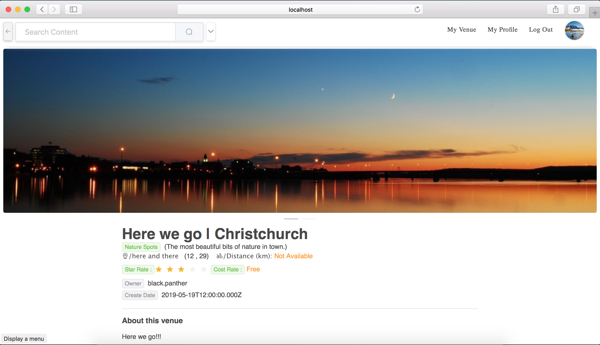
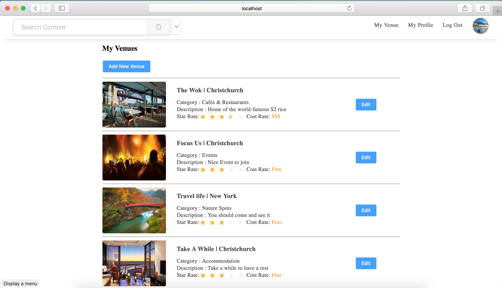
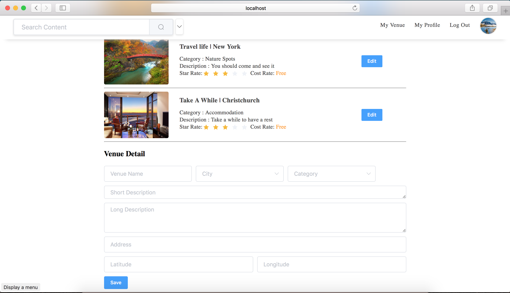
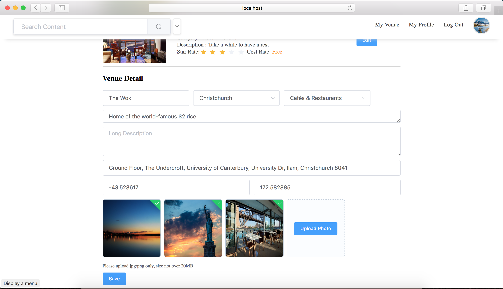
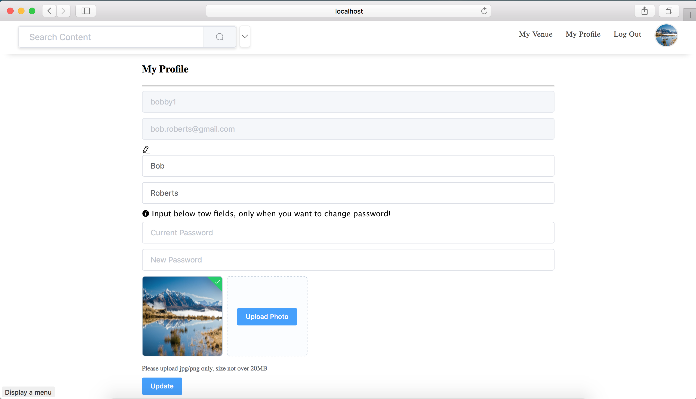

# Web-Computing-Architectures-Client

> A Vue.js project for touring website

## Build Setup

``` bash
# install dependencies
npm install

# serve with hot reload at localhost:8080
npm run dev

# build for production with minification
npm run build
```

For detailed explanation on how things work, consult the [docs for vue-loader](http://vuejs.github.io/vue-loader).


# Demo images

## Login (User can login or as a visitor)


## Register (User can return to login or browsering as a visitor)


## Search (Search data by various conditions)

### Search by keyword:


### Search by more detail condition:


## Venue Detail


## Venue Review (User can review vunue after login)


## My Venue (Owner can maintain their own venues)




## My Profile (Registered User can modify their profile)

